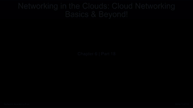

<h1 align="center">🤖 Gemini YouTube Automation</h1>

<p align="center">
  <b>A fully autonomous AI bot that writes, produces, and uploads YouTube lessons daily — zero human input required.</b>
</p>

<p align="center">
  <a href="https://github.com/ChaitanyaEswarRajeshJakki/gemini-youtube-automation/actions/workflows/main.yml">
    
  </a>
  
  
  
  
  
</p>

<p align="center">
  <a href="https://www.youtube.com/@ChaitanyaEswarRajeshJakki/videos">📺 Watch the Generated Videos on YouTube</a>
</p>

---

## Demo



[](https://www.youtube.com/@ChaitanyaEswarRajeshJakki/videos)

---

## What It Does

Every day at **7:00 AM UTC**, this bot runs entirely on GitHub Actions and:

1. **Reads** the content plan to pick the next pending lesson
2. **Writes** a full multi-slide script using Gemini 2.5 Flash
3. **Generates** narration audio (gTTS) and fetches Pexels background imagery
4. **Renders** a professional slide-based video (1920×1080) with background music
5. **Renders** a vertical YouTube Short (1080×1920) from the same lesson
6. **Creates** a custom thumbnail for each format
7. **Uploads** both videos to YouTube with titles, descriptions, and hashtags
8. **Updates** `content_plan.json` and commits it back to the repo

No local machine. No manual steps. Every video in the channel was made by this pipeline.

---

## How It Works

```text
GitHub Actions Scheduler (7 AM UTC)
          │
          â–¼
  ┌───────────────────┐
  │  content_plan.json │  ◄── picks next "pending" lesson
  └────────┬──────────┘
           │
           â–¼
  ┌─────────────────────────────────┐
  │  Gemini 2.5 Flash               │
  │  • 7–8 slide lesson script      │
  │  • 1-sentence YouTube Short     │
  │  • hashtags + metadata          │
  └────────┬────────────────────────┘
           │
           â–¼
  ┌──────────────────────────────────────┐
  │  Video Renderer (MoviePy + PIL)      │
  │  • gTTS narration per slide          │
  │  • Pexels background images          │
  │  • Background music mix              │
  │  • Long-form (16:9) + Short (9:16)   │
  └────────┬─────────────────────────────┘
           │
           â–¼
  ┌────────────────────────┐
  │  YouTube Data API v3   │  ◄── uploads with thumbnails
  └────────┬───────────────┘
           │
           â–¼
  ┌────────────────────────┐
  │  git commit + push     │  ◄── marks lesson "complete"
  └────────────────────────┘
```

---

## Features

- **Zero-touch operation** — fully autonomous, runs on a cron schedule
- **Dual-format output** — long-form lesson video AND a YouTube Short per day
- **AI-generated curriculum** — Gemini creates and extends the course plan automatically
- **Dynamic visuals** — Pexels stock imagery matched to each slide topic
- **Professional audio** — per-slide narration with soft background music
- **Custom thumbnails** — auto-generated for every video
- **Self-updating repo** — content plan committed back after each successful run
- **GitHub Actions native** — no server, no hosting cost, just free CI runners

---

## Tech Stack

| Component | Technology |
| --- | --- |
| AI Script Generation | Google Gemini 2.5 Flash |
| Text-to-Speech | gTTS |
| Video Rendering | MoviePy + FFmpeg |
| Image Generation | Pillow (PIL) + ImageMagick |
| Stock Footage | Pexels API |
| YouTube Upload | YouTube Data API v3 |
| Automation | GitHub Actions |

---

## Setup

### 1. Clone the repo

```bash
git clone https://github.com/ChaitanyaEswarRajeshJakki/gemini-youtube-automation.git
cd gemini-youtube-automation
```

### 2. Install dependencies

```bash
pip install -r requirements.txt
```

### 3. Configure GitHub Secrets

Go to **Settings → Secrets and variables → Actions** and add:

| Secret | Description |
| --- | --- |
| `GOOGLE_API_KEY` | Gemini API key from Google AI Studio |
| `PEXELS_API_KEY` | Pexels API key |
| `CLIENT_SECRET_B64` | YouTube OAuth `client_secrets.json` encoded in base64 |
| `CREDENTIALS_B64` | YouTube OAuth `credentials.json` encoded in base64 |

### 4. Run locally

```bash
python main.py
```

---

## Content Progress

The bot is currently producing the **"AI for Developers"** series — a beginner-friendly course that takes developers from zero to advanced AI.

Topics covered include: Generative AI, LLMs, Prompt Engineering, RAG, Vector Databases, LangGraph, Fine-tuning, Computer Vision, and more.

Track progress live in [content_plan.json](content_plan.json).

---

## Daily Production Infographic


---

## Star History

[](https://star-history.com/#ChaitanyaEswarRajeshJakki/gemini-youtube-automation&Date)

---

## Contributing

Contributions are welcome. Open an issue or submit a pull request.

## License

MIT License. See [LICENSE](LICENSE) for details.
